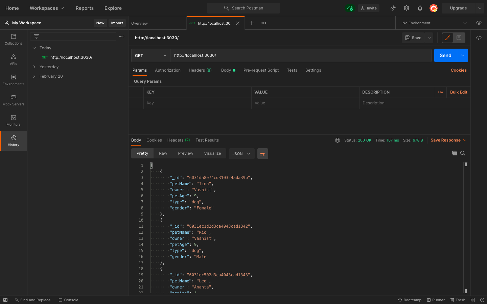
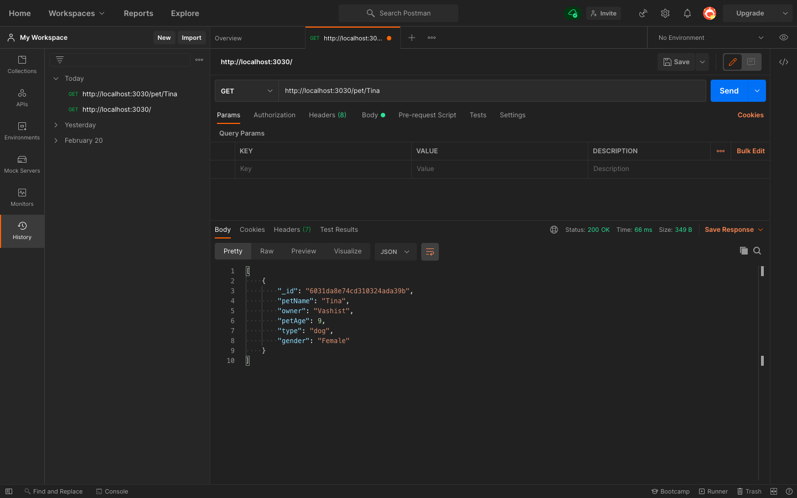
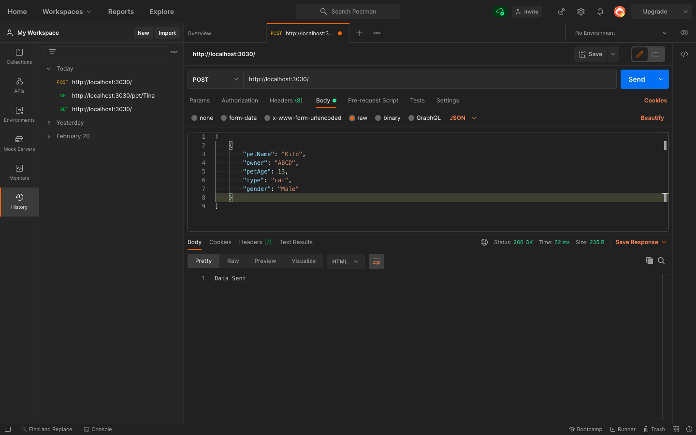
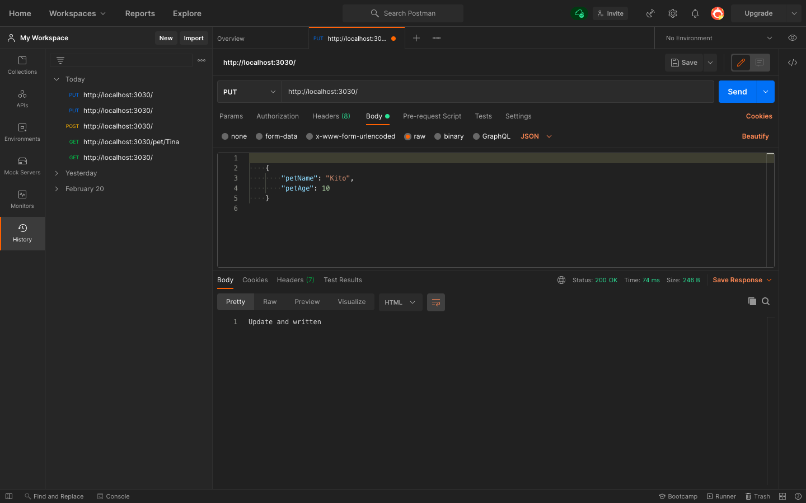
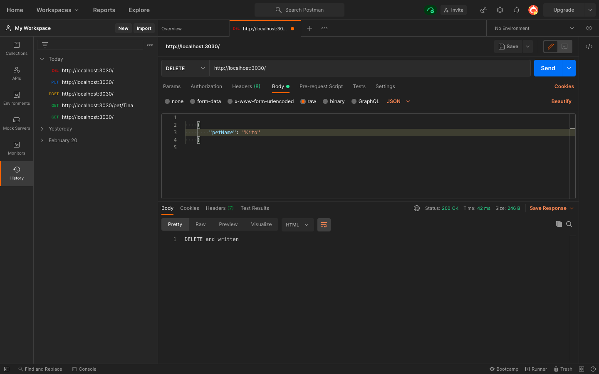
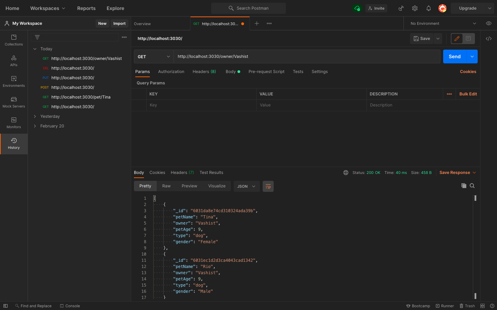
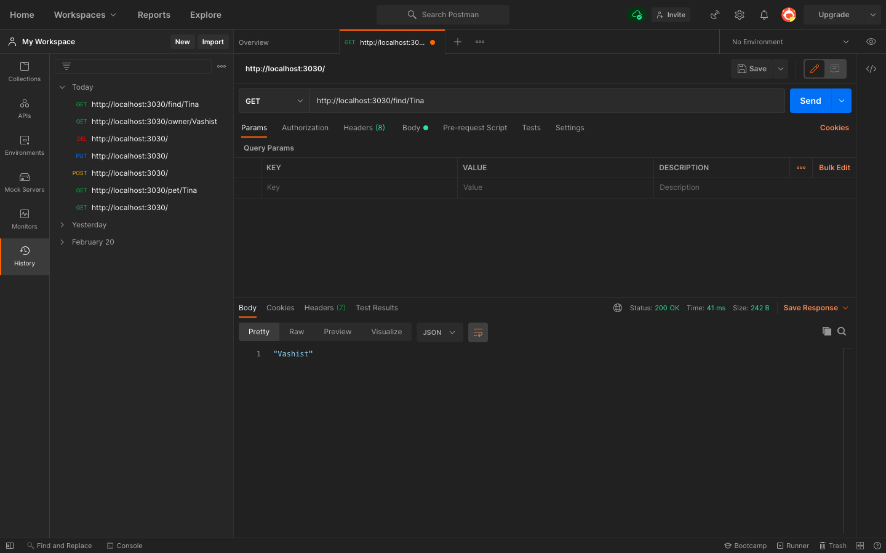
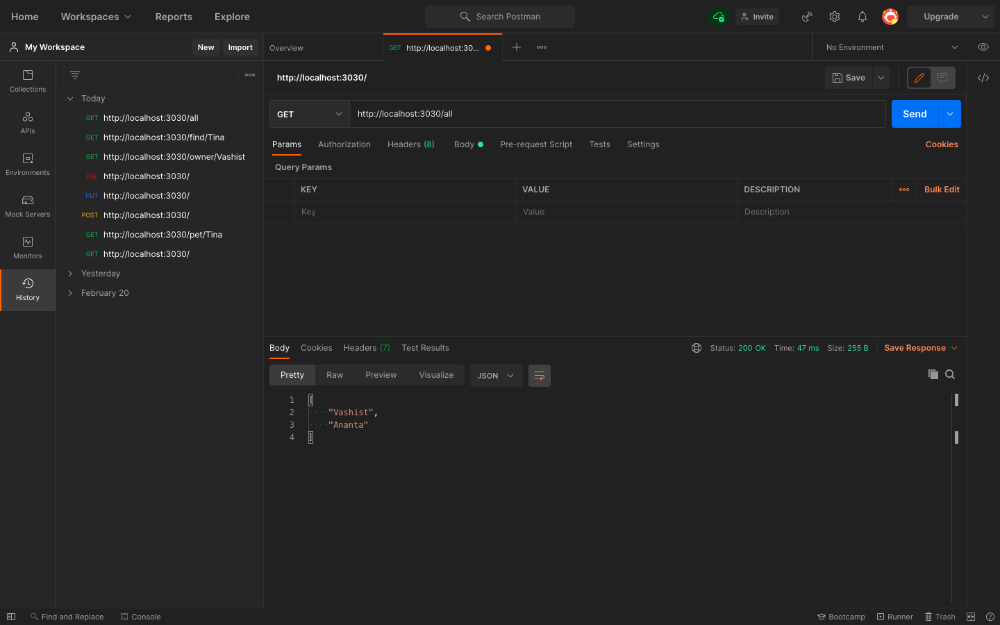

# Pet Store Api

  *DSCSRM Recruitment Technical Task*
  
  *Candidate ID: CAND3353*
  
This project involves reading database and processing its data to perform various actions.

## Pre - Requirement 

- Command Promt / Terminal
- MongoDB Atlas Account
- Postman

## Initialising

1.  `npm i`
2. `MONGO=<mongodb link> node index.js`

### Get All Pets

`GET` `http://localhost:3030/`

### Get A Single Pet

`GET` `http://localhost:3030/pet/<PetName>`

### Create A New Pet

`POST` `http://localhost:3030/`

### Update Existing Pet

`PUT` `http://localhost:3030/`

### Delete A Pet

`DELETE` `http://localhost:3030/`

### Get Pets Of An Owner

`GET` `http://localhost:3030/owner/<Owner>`

### Get Owner Of A Pet

`GET` `http://localhost:3030/find/<PetName>`

### Get List Of All Owners

`GET` `http://localhost:3030/all`

## Screenshots

1. Get All Pets

2. Get A Single Pet

3. Create A New Pet

4. Update Existing Pet

5. Delete A Pet

6. Get Pets Of An Owner

7. Get Owner Of A Pet

8. Get List Of All Owners

